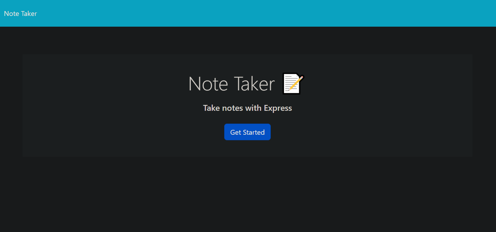
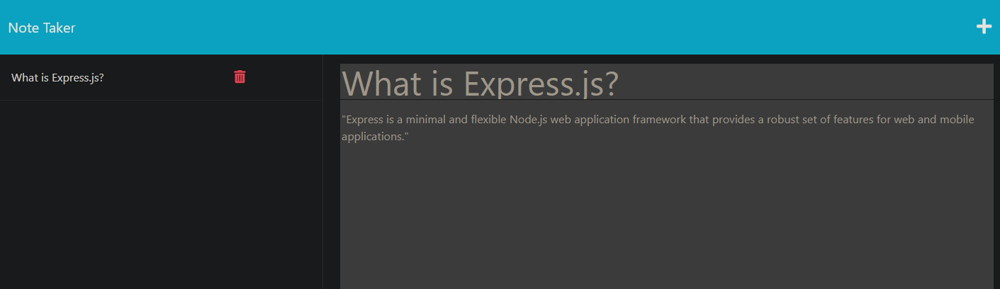

# Note Taker  
  Simple note taking app, demonstrating the functionality of Express.js to setup backend routes between different pages of site. 
  Notes are saved to server database. Notes are interacted with on the server side through various `fetch` calls, can be deleted as well. 

  Site deployed on [Heroku](https://notetaker-module.herokuapp.com/).  

   
  

  ---
  ## Contents

  1. [Installation](#installation)
  2. [License](#license)
  3. [Contact](#contact)

  ---

  ## Installation:
  Git clone. 
  

  ---

  ## License
   

  ---

  ## Contact Information:
  * GitHub Username: robotom01
  * Email: tmrtw8@gmail.com  

